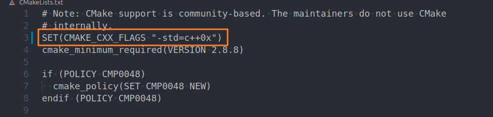
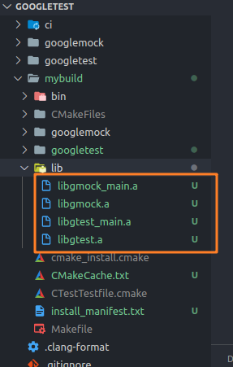
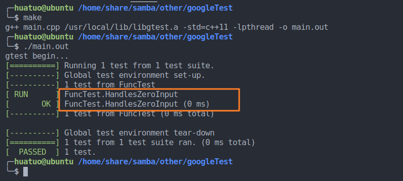

gTest使用

## 1. 安装

### 1.1 Github地址

https://github.com/google/googletest

### 1.2 clone到本地

目录结构如图


### 1.3 编译源码

*前提是安装了`gcc`和`cmake`

在`googletet`目录下执行以下命令：

```bash
mkdir mybuild
cd mybuild
cmake /home/.../googletest/  # googletest文件的绝对路径
make
```

可能会报错：找不到头文件、变量未定义什么的。

解决方案：在googletest目录下（不是googletest/googletest目录）找到CmakeLists.txt

加上

```
SET(CMAKE_CXX_FLAGS "-std=c++0x")
```



`make`成功以后会生成这4个文件



### 1.4 安装到默认环境

```bash
sudo make install
```

它们的意思是将 `googletest` 相关的**头文件**拷贝到 `/usr/local/include/gtest` 目录下，将相关的**库文件**拷贝到 `/usr/local/lib` 下。

### 1.5 简单测试

新建两个文件：`Makefile`、`main.cpp`

```cpp
# main.cpp

#include <iostream>
#include <gtest/gtest.h>

int func(int n)
{
    return n;
}

TEST(FuncTest, HandlesZeroInput) {
  EXPECT_EQ(func(1), 1);
}

int main(int argc, char* argv[])
{
    std::cout << "gtest begin..." << std::endl;

    ::testing::InitGoogleTest(&argc, argv);
    return RUN_ALL_TESTS();
}
```

```makefile
# Makefile

all: main.out

main.out: main.cpp
	g++ $^ /usr/local/lib/libgtest.a -std=c++11 -lpthread -o main.out

clean:
	rm *.out

.PHONY: all clean
```

执行`make`和`./main.out`



OK，到这里环境就算搭建完成了。


## 2. googletest使用

### 2.1 基本概念

当使用gtest框架来进行其实就是通过**断言**来检测我们预置的条件是否成立，如果成立则测试成功，否则为失败，若出出现致命故障还会中止程序运行。

### 2.2 断言介绍

因为断言是我们主要测试手段，所以先介绍断言的种类。

#### 2.2.1 通用断言

判断**条件真假**

| 致命断言                   | 非致命断言                 | 验证条件        |
| -------------------------- | -------------------------- | --------------- |
| `ASSERT_TRUE(condition);`  | `EXPECT_TRUE(condition);`  | `condition`为真 |
| `ASSERT_FALSE(condition);` | `EXPECT_FALSE(condition);` | `condition`为假 |

当这些断言失败，都会记录测试失败。

使用致命类断言失败时会从**当前测试用例退出**；使用非致命断言失败会**继续运行该测试用例**。

#### 2.2.2 数值断言

判断**数值之间的关系**

| 致命断言                 | 非致命断言               | 验证条件       |
| ------------------------ | ------------------------ | -------------- |
| `ASSERT_EQ(val1, val2);` | `EXPECT_EQ(val1, val2);` | `val1 == val2` |
| `ASSERT_NE(val1, val2);` | `EXPECT_NE(val1, val2);` | `val1 != val2` |
| `ASSERT_LT(val1, val2);` | `EXPECT_LT(val1, val2);` | `val1 < val2`  |
| `ASSERT_LE(val1, val2);` | `EXPECT_LE(val1, val2);` | `val1 <= val2` |
| `ASSERT_GT(val1, val2);` | `EXPECT_GT(val1, val2);` | `val1 > val2`  |
| `ASSERT_GE(val1, val2);` | `EXPECT_GE(val1, val2);` | `val1 >= val2` |

这些断言使用的**前提**是`val1`和`val2`是能够使用比较运算符进行比较的。

`*_EQ(val1, val2)`比`*_TRUE(val1 == val2)`好在，如果失败，会打印`val1`和`val2`的具体数值出来。

如果是**用户自定义类型**，即使定义了相应的比较运算符，仍然**不建议使用数值断言**，尽量使用`*_TRUE(val1 >= val2)`这类断言。

在进行**指针**比较时，请使用**`*_EQ(ptr, nullptr)`**和**`*_NE(ptr, nullptr)`** 代替`*_EQ(ptr, NULL)`和`*_NE(ptr, NULL)`。这是因为`nullptr`已经定义过了，而`NULL`并没有。

#### 2.2.3 字符串断言

该组断言是用来比较**C字符串**的，如果比较string对象，使用`*_EQ`、`*_NE`等。

| 致命断言                       | 非致命断言                     | 验证条件                          |
| ------------------------------ | ------------------------------ | --------------------------------- |
| `ASSERT_STREQ(str1,str2);`     | `EXPECT_STREQ(str1,str2);`     | 两个C字符串内容相同               |
| `ASSERT_STRNE(str1,str2);`     | `EXPECT_STRNE(str1,str2);`     | 两个C字符串内容不同               |
| `ASSERT_STRCASEEQ(str1,str2);` | `EXPECT_STRCASEEQ(str1,str2);` | 忽略大小写，两个C字符串的内容相同 |
| `ASSERT_STRCASENE(str1,str2);` | `EXPECT_STRCASENE(str1,str2);` | 忽略大小写，两个C字符串的内容不同 |

注意：一个`NULL` 指针和一个空字符串被认为是*不同的*。

### 2.3 简单测试

创建测试：

1. 使用宏定义`TEST()`来命名一个测试用例，一段没有返回值的C++函数；
2. 此函数中包含有效的C++代码和各种断言；
3. 测试结果由断言结果决定，任意一个断言失败则整个测试用例失败。

```C++
TEST(TestSuiteName, TestName) {
  ... test body ...
}
```

`TEST()`的第一个参数是**测试集**的名称，第二个参数是**测试用例**的名称，命名要符合C++标准，并且尽量不包含下划线（_）。

demo

```C++
#include <iostream>
#include <gtest/gtest.h>

int Factorial(int n)
{
    if((0 == n) || (1 == n)) {
        return 1;
    }

    return n * Factorial(n-1);
}

// Tests factorial of 0.
TEST(FactorialTest, HandlesZeroInput) {
  EXPECT_EQ(Factorial(0), 1);
}

// Tests factorial of positive numbers.
TEST(FactorialTest, HandlesPositiveInput) {
  EXPECT_EQ(Factorial(1), 1);
  EXPECT_EQ(Factorial(2), 2);
  EXPECT_EQ(Factorial(3), 6);
  EXPECT_EQ(Factorial(8), 40320);
}

int main(int argc, char* argv[])
{
    std::cout << "gtest begin..." << std::endl;

    ::testing::InitGoogleTest(&argc, argv);
    return RUN_ALL_TESTS();
}
```

### 2.4 测试夹具（TestFixture）

下面以测试`Sting`类为例。

#### 2.4.1 **一般**的测试方式

```c++
#include <iostream>
#include <gtest/gtest.h>
#include <string>

// 获取string长度
TEST(StringTest, StringLen)
{
  std::string s1 = "Hello"; // #
  EXPECT_EQ(s1.length(), 5);
}

// 拼接string
TEST(StringTest, StringAppend)
{
  std::string s1 = "Hello"; // #
  std::string s2 = "World"; // #
  EXPECT_EQ(s1.append(s2), "HelloWorld");
}

// 交换string
TEST(StringTest, StringSwap)
{
  std::string s1 = "Hello"; // #
  std::string s2 = "World"; // #
  s1.swap(s2);
  EXPECT_EQ(s1, "World");
  EXPECT_EQ(s2, "Hello");
}

// 插入string
TEST(StringTest, StringInsert)
{
  std::string s1 = "Hello"; // #
  std::string s2 = "World"; // #
  EXPECT_EQ(s1.insert(3, s2), "HelWorldlo");
}

int main(int argc, char* argv[])
{
    std::cout << "gtest begin..." << std::endl;

    ::testing::InitGoogleTest(&argc, argv);
    return RUN_ALL_TESTS();
}
```

可以看到代码中用井号`#`标注的部分，是在每个测试用例中都会出现的语句，我们希望，这些重复代码能够在每一个测试用例执行前都被运行一次，换句话说，我们希望有一种更优雅的方式来**管理初始化数据**。

#### 2.4.1 使用TestFixture方式

```c++
#include <iostream>
#include <gtest/gtest.h>
#include <string>

class StringTest : public ::testing::Test {
  protected:
    virtual void SetUp(void) { // 定义开始测试用例前的必要逻辑
      s1 = "Hello";
      s2 = "World";
    }
    virtual void TearDown(void) { // 定义测试用例结束后的逻辑
      std::cout << "teardown" << std::endl;
    }
    std::string s1, s2;
};

TEST_F(StringTest, StringLen)
{
  EXPECT_EQ(s1.length(), 5);
}

TEST_F(StringTest, StringAppend)
{
  EXPECT_EQ(s1.append(s2), "HelloWorld");
}

TEST_F(StringTest, StringSwap)
{
  s1.swap(s2);
  EXPECT_EQ(s1, "World");
  EXPECT_EQ(s2, "Hello");
}

TEST_F(StringTest, StringInsert)
{
  EXPECT_EQ(s1.insert(3, s2), "HelWorldlo");
}

int main(int argc, char* argv[])
{
    std::cout << "gtest begin..." << std::endl;

    ::testing::InitGoogleTest(&argc, argv);
    return RUN_ALL_TESTS();
}
```

需要注意的是：

1. 从类`::testing::Test`派生，需要被`protect`，因为我们从子类访问成员；
2. 在类的内部可以声明我们需要的任何对象；
3. 可以编写**构造函数**或**`SetUp()`函数**，在**析构函数**或**`TearDown()`函数**中释放资源；
4. 在编写测试用例时，使用`TEST_F()`代替`TEST()`。

### 2.5 调用测试

`TEST()`和`TEST_F()`会向googletest框架中注册测试用例，运行`RUN_ALL_TEST()`就可以启动所有测试用例。

在`main()`函数中，必须`return RUN_ALL_TEST()`，否则会有**警告**。

`RUN_ALL_TEST()`只能运行一次。

## 3. googletest的高级使用

### 3.1 其它断言

#### 3.1.1 直接成功或失败

`SUCCEED()`：成功

`FAIL()`：致命的失败

`ADD_FAILURE()`、`ADD_FAILURE_AT()`：非致命的失败

#### 3.1.2 异常断言

| 致命断言                                   | 非致命断言                                 | 验证条件                       |
| ------------------------------------------ | ------------------------------------------ | ------------------------------ |
| `ASSERT_THROW(statement, exception_type);` | `EXPECT_THROW(statement, exception_type);` | `statement` 抛出给定类型的异常 |
| `ASSERT_ANY_THROW(statement);`             | `EXPECT_ANY_THROW(statement);`             | `statement` 引发任何类型的异常 |
| `ASSERT_NO_THROW(statement);`              | `EXPECT_NO_THROW(statement);`              | `statement` 不会抛出任何异常   |

demo

```C++
#include <iostream>
#include <gtest/gtest.h>

int func(int n)
{
  if(0 == n) {
    throw "InputZero";
  }
  return 100/n;
}

TEST(FuncTest, InputZero)
{
  EXPECT_THROW(func(0), const char*); // 期望的异常为'const char*'类型
}

TEST(FunTEST, InputNum)
{
  EXPECT_NO_THROW(func(10));
}

int main(int argc, char* argv[])
{
  std::cout << "gtest begin" << std::endl;

  ::testing::InitGoogleTest(&argc, argv);
  return RUN_ALL_TESTS();
}
```

#### 3.1.3 谓词断言

就算gtest已经拥有了很多的断言方法，也不可能满足所有人的使用需求。

有时候用户需要使用`EXPECT_TRUE()`来检查一个复杂的表达式，但是只能看到结果，不能在检测结果中看到表达式各部分（或者说各参数）的值，因此，gtest提供了下面的断言：

| 致命断言                          | 非致命断言                        | 验证条件                   |
| --------------------------------- | --------------------------------- | -------------------------- |
| `ASSERT_PRED1(pred1, val1)`       | `EXPECT_PRED1(pred1, val1)`       | `pred1(val1)` 是真的       |
| `ASSERT_PRED2(pred2, val1, val2)` | `EXPECT_PRED2(pred2, val1, val2)` | `pred2(val1, val2)` 是真的 |
| `...`                             | `...`                             | `...`                      |

demo

```c++
#include <iostream>
#include <gtest/gtest.h>

bool func(int n)  // 返回值必须是布尔类型
{
  if(0 == n%2) {
    return true;
  }
  return false;
}

TEST(FuncTest, InputZero)
{
  for(int i = 0; i < 9; i++) {
    EXPECT_PRED1(func, i);
  }
}

int main(int argc, char* argv[])
{
  std::cout << "gtest begin" << std::endl;

  ::testing::InitGoogleTest(&argc, argv);
  return RUN_ALL_TESTS();
}
```

运行测试框架，有类似输出

```
main.cpp:15: Failure
func(i) evaluates to false, where
i evaluates to 1
main.cpp:15: Failure
func(i) evaluates to false, where
i evaluates to 3
main.cpp:15: Failure
func(i) evaluates to false, where
i evaluates to 5
main.cpp:15: Failure
func(i) evaluates to false, where
i evaluates to 7
```

#### 3.1.4 谓词格式化断言

如果使用者觉得现有的谓词断言的结果打印格式不满足要求可以使用**格式化的谓词断言**。

| 致命断言                                         | 非致命断言                                       | 验证条件                        |
| ------------------------------------------------ | ------------------------------------------------ | ------------------------------- |
| `ASSERT_PRED_FORMAT1(pred_format1, val1);`       | `EXPECT_PRED_FORMAT1(pred_format1, val1);`       | `pred_format1(val1)` 成功       |
| `ASSERT_PRED_FORMAT2(pred_format2, val1, val2);` | `EXPECT_PRED_FORMAT2(pred_format2, val1, val2);` | `pred_format2(val1, val2)` 成功 |
| `...`                                            | `...`                                            | ...                             |

demo

```c++
#include <iostream>
#include <gtest/gtest.h>

bool func(int n)
{
  if(0 == n%2) {
    return true;
  }
  return false;
}

::testing::AssertionResult assert_func(const char* n_expr, int n) // n_expr为表达式
{
  if(func(n)) {
    return ::testing::AssertionSuccess();
  } else {
    // 自定义打印格式
    return ::testing::AssertionFailure() << n_expr << '(' << n << ')' << " is not even number.";
  }
}

TEST(FuncTest, InputZero)
{
  for(int i = 0; i < 9; i++) {
    EXPECT_PRED_FORMAT1(assert_func, i); // 使用格式化后的断言
  }
}

int main(int argc, char* argv[])
{
  std::cout << "gtest begin" << std::endl;

  ::testing::InitGoogleTest(&argc, argv);
  return RUN_ALL_TESTS();
}
```

结果为：

```
main.cpp:24: Failure
i(1) is not even number.
main.cpp:24: Failure
i(3) is not even number.
main.cpp:24: Failure
i(5) is not even number.
main.cpp:24: Failure
i(7) is not even number.
```

#### 3.1.5 浮点数比较

浮点数比较本身就有舍入误差，很难完全匹配。一般比较浮点数需要选择一个误差范围进行比较，但如果使用者并不在意这个误差，则比较“最后位置”（ULP）是一个很好的默认值，并且googletest提供了断言来做到这一点。

| 致命断言                        | 非致命断言                      | 验证条件                 |
| ------------------------------- | ------------------------------- | ------------------------ |
| `ASSERT_FLOAT_EQ(val1, val2);`  | `EXPECT_FLOAT_EQ(val1, val2);`  | 这两个`float`值几乎相等  |
| `ASSERT_DOUBLE_EQ(val1, val2);` | `EXPECT_DOUBLE_EQ(val1, val2);` | 这两个`double`值几乎相等 |

“几乎相等”是指这些值彼此之间在4个ULP之内。

以下断言允许您选择可接受的错误范围：

| 致命断言                              | 非致命断言                            | 验证条件                                     |
| ------------------------------------- | ------------------------------------- | -------------------------------------------- |
| `ASSERT_NEAR(val1, val2, abs_error);` | `EXPECT_NEAR(val1, val2, abs_error);` | 之间的差异`val1`和`val2`不超过给定的绝对误差 |

一些浮点运算很有用，但并不常用。为了避免出现新的宏，我们将它们提供为可用于谓词断言宏（例如`EXPECT_PRED_FORMAT2`）的谓词格式函数。

```c++
EXPECT_PRED_FORMAT2(::testing::FloatLE, val1, val2);
EXPECT_PRED_FORMAT2(::testing::DoubleLE, val1, val2);
```

验证`val1`小于或几乎等于`val2`。您可以`EXPECT_PRED_FORMAT2`在上表中将替换 为`ASSERT_PRED_FORMAT2`。

#### 3.1.6 类型断言

可以调用该函数

```c++
::testing::StaticAssertTypeEq<T1, T2>();
```

断言类型`T1`和`T2`相同。如果类型不同，并不会出现失败的测试用例，而是**直接编译不通过**。

demo

```c++
TEST(FuncTest, InputZero)
{
  int a = 0;
  char b = 0;
  ::testing::StaticAssertTypeEq<int, int>();
}
```

编译的时候会有类似错误提示：

```
/usr/local/include/gtest/gtest.h:2309:3: error: static assertion failed: T1 and T2 are not the same type
   static_assert(std::is_same<T1, T2>::value, "T1 and T2 are not the same type");
   ^~~~~~~~~~~~~
```

### 3.2 死亡测试

在许多应用程序中，如果不满足条件，则有一些断言可能导致应用程序失败。这些健全性检查可确保程序处于已知的良好状态，并在某些程序状态损坏后的最早可能的时间在那里失败。如果断言检查了错误的条件，则程序可能会以错误的状态运行，这可能导致内存损坏，安全漏洞或更糟。因此，测试此类断言语句是否按预期工作至关重要。

由于这些前提条件检查会导致进程死亡，因此我们将此类测试称为 *死亡测试*。更一般而言，任何以预期方式检查程序是否终止（除非引发异常）的测试也都是死亡测试。

请注意，如果一段代码抛出异常，则出于死亡测试的目的，我们不会将其视为“死亡”，因为代码的调用者可以捕获该异常并避免崩溃。如果要验证代码引发的[异常](#ExceptionAssertions)，请参见[异常断言](#ExceptionAssertions)。

如果要`EXPECT_*()/ASSERT_*()`在测试代码中测试失败，请参阅捕获失败

googletest具有以下宏来支持死亡测试：

| 致命断言                                         | 非致命断言                                       | 验证条件                                                     |
| ------------------------------------------------ | ------------------------------------------------ | ------------------------------------------------------------ |
| `ASSERT_DEATH(statement, matcher);`              | `EXPECT_DEATH(statement, matcher);`              | `statement` 崩溃与给定的错误                                 |
| `ASSERT_DEATH_IF_SUPPORTED(statement, matcher);` | `EXPECT_DEATH_IF_SUPPORTED(statement, matcher);` | 如果支持死亡测试，`statement`则以给定的错误验证是否崩溃；否则什么都不验证 |
| `ASSERT_DEBUG_DEATH(statement, matcher);`        | `EXPECT_DEBUG_DEATH(statement, matcher);`        | `statement`**在调试模式下**由于给定的错误**而**崩溃。如果不在调试中（即已`NDEBUG`定义），则仅执行`statement` |
| `ASSERT_EXIT(statement, predicate, matcher);`    | `EXPECT_EXIT(statement, predicate, matcher);`    | `statement` 以给定的错误退出，并且其退出代码匹配 `predicate` |

where `statement`是预期导致进程终止的语句，是 `predicate`评估整数退出状态的函数或函数对象，并且`matcher`是与a `const std::string&` 或（Perl）正则表达式匹配的gMock匹配器-两者均与stderr的输出`statement`。出于传统原因，裸字符串（即没有匹配器）被解释为`ContainsRegex(str)`，**而不是** `Eq(str)`。请注意，它`statement` 可以是*任何有效的语句*（包括*复合语句*），而不必是表达式。

像往常一样，`ASSERT`变量会中止当前的测试功能，而 `EXPECT`变量不会。

### 3.3 正则表达式语法

在POSIX系统（例如Linux，Cygwin和Mac）上，googletest使用 [POSIX扩展正则表达式](http://www.opengroup.org/onlinepubs/009695399/basedefs/xbd_chap09.html#tag_09_04) 语法。要了解这种语法，您可能需要阅读 [Wikipedia条目](http://en.wikipedia.org/wiki/Regular_expression#POSIX_Extended_Regular_Expressions)。

在Windows上，googletest使用其自己的简单正则表达式实现。它缺少许多功能。例如，我们不支持联合（`"x|y"`），分组（`"(xy)"`），方括号（`"[xy]"`）和重复计数（`"x{5,7}"`）等。以下是我们所支持的（`A`表示文字字符，句点（`.`）或单个`\\`转义序列；`x`并`y`表示正则表达式。）：

| 表达  | 含义                                 |
| ----- | ------------------------------------ |
| `c`   | 匹配任何文字字符 `c`                 |
| `\\d` | 匹配任何十进制数字                   |
| `\\D` | 匹配任何非十进制数字的字符           |
| `\\f` | 火柴 `\f`                            |
| `\\n` | 火柴 `\n`                            |
| `\\r` | 火柴 `\r`                            |
| `\\s` | 匹配任何ASCII空格，包括 `\n`         |
| `\\S` | 匹配任何非空格字符                   |
| `\\t` | 火柴 `\t`                            |
| `\\v` | 火柴 `\v`                            |
| `\\w` | 匹配任何字母`_`、、或十进制数字      |
| `\\W` | 匹配任何`\\w`不匹配的字符            |
| `\\c` | 匹配任何文字字符`c`，必须是标点符号  |
| `.`   | 匹配任何单个字符，除了 `\n`          |
| `A?`  | 匹配0或1次出现 `A`                   |
| `A*`  | 匹配0或多次出现 `A`                  |
| `A+`  | 匹配1个或多次出现 `A`                |
| `^`   | 匹配字符串的开头（不是每一行的开头） |
| `$`   | 匹配字符串的结尾（不是每一行的结尾） |
| `xy`  | 比赛`x`之后`y`                       |

为了帮助您确定系统上可用的功能，googletest定义了宏来控制其使用的正则表达式。宏为： `GTEST_USES_SIMPLE_RE=1`或`GTEST_USES_POSIX_RE=1`。如果要使您的死亡测试在所有情况下都有效，则可以`#if`在这些宏上使用，也可以仅使用限制更小的语法。

## 4. googlemock

### 4.0 一个简单的例子

被测函数：

```c++
int func(FooFunc& ff)
{
    return ff.get_random();
}
```

`FooFunc`的定义在`foo.h`中

```c++
// foo.h
#ifndef __FOO_H__
#define __FOO_H__

class FooFunc {
    public:
    virtual int get_random(void) = 0;
    virtual bool bigger_than(int a, int b) = 0;

};

#endif
```

main.cpp

```c++
#include <iostream>
#include <gtest/gtest.h>
#include <gmock/gmock.h>  // gmock的头文件

#include "foo.h"

class MockFooFunc: public FooFunc {  // mock一个FooFunc
public:
    MOCK_METHOD(int, get_random, (), (override));  // mock一个get_random方法
    MOCK_METHOD(bool, bigger_than, (int, int), (override));
};

int func(FooFunc& ff)
{
    return ff.get_random();
}

TEST(FuncTest, HandlesZeroInput) {
    MockFooFunc mff;
    // 期望get_random()被调用后的反应
    EXPECT_CALL(mff, get_random())
        .Times(1) 	// 期望被调用一次
        .WillOnce(testing::Return(1));  // 返回值为1，如果未定义，则返回值“不确定”
    EXPECT_EQ(func(mff), 1);
}

int main(int argc, char* argv[])
{
    std::cout << "gtest begin..." << std::endl;

    ::testing::InitGoogleMock(&argc, argv);  // 初始化gmock
    ::testing::InitGoogleTest(&argc, argv);
    return RUN_ALL_TESTS();
}

```

同时需要修改Makefile文件

```makefile
all: main.out

main.out: main.cpp
	g++ $^ /usr/local/lib/libgmock.a /usr/local/lib/libgtest.a -std=c++11 -lpthread -o $@

run: main.out
	./$<

clean:
	rm *.out

.PHONY: all clean

```

### 4.1 基本用法

#### 4.1.0 一般语法

```c++
EXPECT_CALL(mock_object, method(matchers))  // 逗号','而非点'.'
    .Times(cardinality)  // 被调用的次数
    .WillOnce(action)  // 被调用时的行为
    .WillRepeatedly(action);  // 此后被调用的行为
```

例如：

```c++
using ::testing::Return;
...
EXPECT_CALL(mff, get_random())
    .Times(5)  // 被调用5次
    .WillOnce(Return(100))  // 第一次返回100
    .WillOnce(Return(150))  // 第二次返回150
    .WillRepeatedly(Return(200));  // 以后返回200
```

#### 4.1.1 期望的参数

如果mock的方法是带有参数的，则在EXPECT的时候需要指定参数，例如：

```c++
int func(FooFunc& ff)
{
    if(ff.bigger_than(10, 20)) {
        return 1;
    }

    return 0;
}

TEST(FuncTest, HandlesZeroInput) {
    MockFooFunc mff;
    EXPECT_CALL(mff, bigger_than(20, 20))
        .Times(1)
        .WillOnce(testing::Return(true));

    EXPECT_EQ(func(mff), 1);
}
```

如果希望对参数（或某个参数不敏感），可以使用`testing::_`，例如：

```c++
TEST(FuncTest, HandlesZeroInput) {
    MockFooFunc mff;
    EXPECT_CALL(mff, bigger_than(::testing::_, 20))  // 只限定第二个参数是20
        .Times(1)
        .WillOnce(testing::Return(true));

    EXPECT_EQ(func(mff), 1);
}
```

在5.4章节中有展示许多内置的匹配器。


## 5. gMock内置匹配器

### 5.1 定义模拟类

#### 5.1.1 模拟普通的类

给定

```c++
#ifndef __FOO_H__
#define __FOO_H__

#include <string>

struct Bar {
    std::string name;
    int longth;
};

class Foo {
  virtual ~Foo(); // ~Foo() 必须是虚拟的
  virtual int GetSize() const = 0;
  virtual std::string Describe(const char* name) = 0;
  virtual std::string Describe(int type) = 0;
  virtual bool Process(Bar elem, int count) = 0;
};

#endif

```

可以模拟定义为

```c++
#include <gmock/gmock.h>
#include "foo.h"

Foo::~Foo()
{}

class MockFoo: public Foo {
public:
    virtual ~MockFoo() {};
    MOCK_METHOD(int, GetSize, (), (const, override));
    MOCK_METHOD(std::string, Describe, (const char* name), (override));
    MOCK_METHOD(std::string, Describe, (int type), (override));
    MOCK_METHOD(bool, Process, (Bar elem, int count), (override));
};


```

还可以继续创建一些特殊的mock

```c++
using ::testing::NiceMock;
using ::testing::NaggyMock;
using ::testing::StrictMock;

NiceMock<MockFoo> nice_foo;      // 对于没有期望但是调用的方法，不报错
NaggyMock<MockFoo> naggy_foo;    // 对于没有期望但是调用的方法，报警告
StrictMock<MockFoo> strict_foo;  // 对于没有期望但是调用的方法，报错
```

例如：

```c++
TEST(FuncTest, HandlesZeroInput) {
    // MockFoo foo;
    testing::StrictMock<MockFoo> foo;  //使用Strict
    EXPECT_CALL(foo, GetSize())
        .Times(1)
        .WillOnce(testing::Return(10));
    int size = foo.GetSize();
    std::string s = foo.Describe("haha"); //因为使用的是Strict，又没有expect，所以是失败的用例
    std::cout << "size: " << size << std::endl;
    std::cout << "s: " << s << std::endl;
}

```

#### 5.1.2 模拟类模板

### 5.2 在测试中使用模拟程序（UsingMocks）

典型流程：

> 1. 导入需要使用的gMock名称。`testing`除非它们是宏或另有说明，否则所有gMock符号都在 名称空间中。
> 2. 创建模拟对象。
> 3. （可选）设置模拟对象的默认操作。(ON_CALL)
> 4. 对模拟对象设置期望（如何调用它们？它们将做什么？）。（EXPECT_CALL）
> 5. 使用模拟对象的练习代码；如有必要，请使用googletest断言检查结果。
> 6. 销毁模拟对象后，gMock会自动验证是否满足对它的所有期望。

例子：()

```cpp
std::string myFunc(Foo *foo)
{
    std::string s;
    for(int i = 0; i < 3; i++) {
        s = foo->Describe(5);
    }
    if("Category 5" != s) {
        return "bad";
    }
    return "good";
}


TEST(FuncTest, HandlesZeroInput) {
    MockFoo foo;
    ON_CALL(foo, GetSize())
        .WillByDefault(testing::Return(1));

    EXPECT_CALL(foo, Describe(5))
        .Times(3)
        .WillRepeatedly(testing::Return("Category 5"));

    std::cout << foo.GetSize() << std::endl;
    EXPECT_EQ("good", myFunc(&foo));
}
```

运行结果：

```
gtest begin...
[==========] Running 1 test from 1 test suite.
[----------] Global test environment set-up.
[----------] 1 test from FuncTest
[ RUN      ] FuncTest.HandlesZeroInput

GMOCK WARNING:
Uninteresting mock function call - taking default action specified at:
main.cpp:33:
    Function call: GetSize()
          Returns: 1
NOTE: You can safely ignore the above warning unless this call should not happen.  Do not suppress it by blindly adding an EXPECT_CALL() if you don't mean to enforce the call.  See https://github.com/goog
le/googletest/blob/master/googlemock/docs/cook_book.md#knowing-when-to-expect for details.
1
[       OK ] FuncTest.HandlesZeroInput (4 ms)
[----------] 1 test from FuncTest (4 ms total)

[----------] Global test environment tear-down
[==========] 1 test from 1 test suite ran. (5 ms total)
[  PASSED  ] 1 test.
```

### 5.2 设置默认操作（ON_CALL）

对于返回， 数值或指针的任何函数，gMock都有一个**内置的默认操作**。在C ++ 11中，如果给定类型存在默认值，它将另外返回默认构造的值。方法如下：

```
// Sets the default value to be returned. T must be CopyConstructible.
DefaultValue<T>::Set(value);
// Sets a factory. Will be invoked on demand. T must be MoveConstructible.
//  T MakeT();
DefaultValue<T>::SetFactory(&MakeT);
// ... use the mocks ...
// Resets the default value.
DefaultValue<T>::Clear();
```

例如：

```cpp
bool justBool()
{
    return false;
}

TEST(FuncTest, HandlesZeroInput) {
    MockFoo foo;
    testing::DefaultValue<std::string>::Set("hello");
    testing::DefaultValue<int>::SetFactory([] {
                if(justBool()){return 1;}
                return 0;
            });
    // ON_CALL(foo, GetSize())
        // .WillByDefault(testing::Return(1));

    EXPECT_CALL(foo, Describe(5))
        .Times(3)
        .WillRepeatedly(testing::Return("Category 5"));

    std::cout << foo.GetSize() << std::endl;
    EXPECT_EQ("good", myFunc(&foo));

    testing::DefaultValue<int>::Clear();
    testing::DefaultValue<std::string>::Clear();
}

```

要为特定模拟对象的特定方法自定义默认操作，请使用`ON_CALL()`。`ON_CALL()`具有与相似的语法`EXPECT_CALL()`，但是用于设置默认行为。

```
ON_CALL(mock-object, method(matchers))
    .With(multi-argument-matcher)   ?
    .WillByDefault(action);
```

### 5.3 设定期望（ExpectCall）

`EXPECT_CALL()`对模拟方法设定**期望**（它将如何被调用？它将做什么？）：

```cpp
EXPECT_CALL(mock-object, method (matchers)?)
     .With(multi-argument-matcher)  ?
     .Times(cardinality)            ?
     .InSequence(sequences)         *
     .After(expectations)           *
     .WillOnce(action)              *
     .WillRepeatedly(action)        ?
     .RetiresOnSaturation();        ?
```

`?`表示最多只能使用一次，而`*`表示可以多次使用。

### 5.4 匹配器（MatcherList）

#### 通配符

| 匹配器            | 描述                                 |
| :---------------- | :----------------------------------- |
| `_`               | `argument` 可以是正确类型的任何值。  |
| `A()` 要么 `An()` | `argument`可以是type的任何值`type`。 |

#### 通用比较

| 匹配器                   | 描述                                                         |
| :----------------------- | :----------------------------------------------------------- |
| `Eq(value)` 要么 `value` | `argument == value`                                          |
| `Ge(value)`              | `argument >= value`                                          |
| `Gt(value)`              | `argument > value`                                           |
| `Le(value)`              | `argument <= value`                                          |
| `Lt(value)`              | `argument < value`                                           |
| `Ne(value)`              | `argument != value`                                          |
| `IsFalse()`              | `argument``false`在布尔上下文中计算为。                      |
| `IsTrue()`               | `argument``true`在布尔上下文中计算为。                       |
| `IsNull()`               | `argument`是`NULL`指针（原始或智能）。                       |
| `NotNull()`              | `argument` 是一个非空指针（原始或智能）。                    |
| `Optional(m)`            | `argument`是`optional<>`包含一个值匹配`m`。（要测试是否`optional<>`设置了an ，请检查是否与相等`nullopt`。`Eq(nullopt)`如果内部类型不具有，则可能需要使用`==`。） |
| `VariantWith(m)`         | `argument`是`variant<>`持有类型T具有值匹配的替代项`m`。      |
| `Ref(variable)`          | `argument`是对的引用`variable`。                             |
| `TypedEq(value)`         | `argument`具有类型`type`，等于`value`。您可能需要使用它，而不是`Eq(value)`在模拟函数重载时使用它。 |

**注意**：如果一个方法是多态存在的，好像就不能使用上面的匹配器。

例如：

```cpp
EXPECT_CALL(foo, Describe(testing::Lt(5)))  // 期望参数是小于5的
    .Times(3)
    .WillRepeatedly(testing::Return("Category 5"));

```

需要屏蔽：

```cpp
virtual std::string Describe(const char* name) = 0; //foo.h
MOCK_METHOD(std::string, Describe, (const char* name), (override)); //main.cpp
```

#### 5.4.1 浮点型匹配器

| 匹配器                           | 描述                                                         |
| :------------------------------- | :----------------------------------------------------------- |
| `DoubleEq(a_double)`             | `argument`是一个`double`近似等于的值`a_double`，将两个NaN视为不相等。 |
| `FloatEq(a_float)`               | `argument`是一个`float`近似等于的值`a_float`，将两个NaN视为不相等。 |
| `NanSensitiveDoubleEq(a_double)` | `argument`是一个`double`近似等于的值`a_double`，将两个NaN视为相等。 |
| `NanSensitiveFloatEq(a_float)`   | `argument`是一个`float`近似等于的值`a_float`，将两个NaN视为相等。 |
| `IsNan()`                        | `argument` 是具有NaN值的任何浮点类型。                       |

上述匹配器使用基于ULP的比较（与googletest中使用的相同）。他们根据期望值的绝对值自动选择合理的误差范围。`DoubleEq()`并`FloatEq()`符合IEEE标准，该标准要求比较两个NaN是否相等以返回false。`NanSensitive*`相反，该 版本将两个NaN视为相等，这通常是用户想要的。

| 匹配器                                            | 描述                                                         |
| :------------------------------------------------ | :----------------------------------------------------------- |
| `DoubleNear(a_double, max_abs_error)`             | `argument`是`double`接近`a_double`（绝对误差<= `max_abs_error`）的值，将两个NaN视为不相等。 |
| `FloatNear(a_float, max_abs_error)`               | `argument`是`float`接近`a_float`（绝对误差<= `max_abs_error`）的值，将两个NaN视为不相等。 |
| `NanSensitiveDoubleNear(a_double, max_abs_error)` | `argument`是一个`double`接近`a_double`（绝对误差<= `max_abs_error`）的值，将两个NaN视为相等。 |
| `NanSensitiveFloatNear(a_float, max_abs_error)`   | `argument`是一个`float`接近`a_float`（绝对误差<= `max_abs_error`）的值，将两个NaN视为相等。 |

#### 5.4.2 字符串匹配器

的`argument`可以是C字符串或C ++字符串对象：

| 匹配器                  | 描述                                                         |
| :---------------------- | :----------------------------------------------------------- |
| `ContainsRegex(string)` | `argument` 匹配给定的正则表达式。                            |
| `EndsWith(suffix)`      | `argument`以string结尾`suffix`。                             |
| `HasSubstr(string)`     | `argument`包含`string`为子字符串。                           |
| `MatchesRegex(string)`  | `argument` 匹配给定的正则表达式，匹配从第一个字符开始，最后一个字符结束。 |
| `StartsWith(prefix)`    | `argument`以string开头`prefix`。                             |
| `StrCaseEq(string)`     | `argument`等于`string`，忽略大小写。                         |
| `StrCaseNe(string)`     | `argument`不等于`string`，忽略大小写。                       |
| `StrEq(string)`         | `argument`等于`string`。                                     |
| `StrNe(string)`         | `argument`不等于`string`。                                   |

### 5.5 动作（ActionList）

**动作 **是指定模拟函数在调用时应执行的操作。

#### 返回值

| 方法                              | 作用                                                         |
| :-------------------------------- | :----------------------------------------------------------- |
| `Return()`                        | 从`void`模拟函数返回。                                       |
| `Return(value)`                   | 返回`value`。如果的类型`value`与模拟函数的返回类型不同，`value`则*在设置期望*时（而不是在执行操作时）将其转换为后者。 |
| `ReturnArg()`                     | 返回`N`-th（从0开始）参数。                                  |
| `ReturnNew(a1, ..., ak)`          | 回报`new T(a1, ..., ak)`; 每次创建一个不同的对象。           |
| `ReturnNull()`                    | 返回一个空指针。                                             |
| `ReturnPointee(ptr)`              | 返回由指向的值`ptr`。                                        |
| `ReturnRef(variable)`             | 返回对的引用`variable`。                                     |
| `ReturnRefOfCopy(value)`          | 返回对副本的引用`value`；副本与动作一样有效。                |
| `ReturnRoundRobin({a1, ..., ak})` | 每个呼叫将返回`ai`列表中的下一个，从到达列表末尾的开头开始。 |

#### **使用函数作为动作**

| 方法                                                | 描述                                                         |
| :-------------------------------------------------- | :----------------------------------------------------------- |
| `f`                                                 | 使用传递给模拟函数的参数调用f，其中f是可调用的。             |
| `Invoke(f)`                                         | 调用`f`传递给模拟函数的参数，其中`f`可以是全局/静态函数或函子。 |
| `Invoke(object_pointer, &class::method)`            | 使用传递给模拟函数的参数在对象上调用方法。                   |
| `InvokeWithoutArgs(f)`                              | 调用`f`，可以是全局/静态函数或函子。`f`必须不带任何参数。    |
| `InvokeWithoutArgs(object_pointer, &class::method)` | 调用不带参数的对象上的方法。                                 |
| `InvokeArgument(arg1, arg2, ..., argk)`             | 调用模拟函数的`N`-th（基于0的）参数，该参数必须是函数或函子`k`。 |

### 5.6 次数（CardinalityList）

这些用于`Times()`指定模拟函数将被调用多少次：

| 方法              | 描述                                                         |
| :---------------- | :----------------------------------------------------------- |
| `AnyNumber()`     | 可以多次调用该函数。                                         |
| `AtLeast(n)`      | 至少要`n`次调用。                                            |
| `AtMost(n)`       | 最多`n`次调用。                                              |
| `Between(m, n)`   | 调用预计在`m`和`n`（含）次之间进行。                         |
| `Exactly(n) or n` | 预计该调用将是确切的`n`时间。注意，当`n`值为0 时，该调用永远不会发生。 |

### 5.7 期望顺序（After）

示例：

```cpp
TEST(FuncTest, HandlesZeroInput) {
    MockFoo foo;
    testing::Expectation int_x = EXPECT_CALL(foo, GetSize())
        .WillOnce(testing::Return(1));

    EXPECT_CALL(foo, Describe(5))
        .After(int_x) //在int_x后才可以调用Describe(5)
        //.After(int_x, int_y, int_z) 期望在x，y，z后才被调用
        .WillOnce(testing::Return("Category 5"));

    std::cout << foo.GetSize() << std::endl;
    std::cout << foo.Describe(5) << std::endl;
}

```

如果在编写期望时不知道期望有多少个先决条件，则可以使用`ExpectationSet`来收集它们：

```cpp
using ::testing::ExpectationSet;
...
ExpectationSet all_inits;
for (int i = 0; i < element_count; i++) {
  all_inits += EXPECT_CALL(foo, InitElement(i));
}
EXPECT_CALL(foo, Bar())
     .After(all_inits);
```

表示`Bar()`只能在所有元素都初始化后才能调用（但我们不在乎哪个元素在其他元素之前被初始化）。

### 5.8 序列（Sequences）


示例：

```cpp
TEST(FuncTest, HandlesZeroInput) {
    MockFoo foo;
    testing::Sequence s1, s2;

    EXPECT_CALL(foo, Describe(1))
        .InSequence(s1, s2)
        .WillOnce(testing::Return("Category 1"));

    EXPECT_CALL(foo, Describe(2))
        .InSequence(s1)
        .WillOnce(testing::Return("Category 2"));

    EXPECT_CALL(foo, Describe(3))
        .InSequence(s2)
        .WillOnce(testing::Return("Category 3"));

    std::cout << foo.Describe(1) << std::endl;
    std::cout << foo.Describe(2) << std::endl;
    std::cout << foo.Describe(3) << std::endl;  //先执行3，再执行2也是OK的
}
```


## 6. gMock食谱


